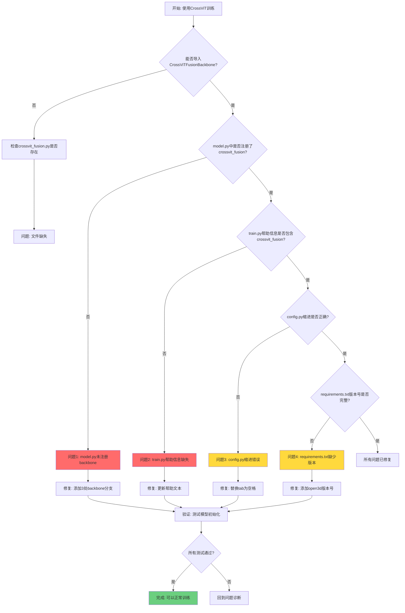
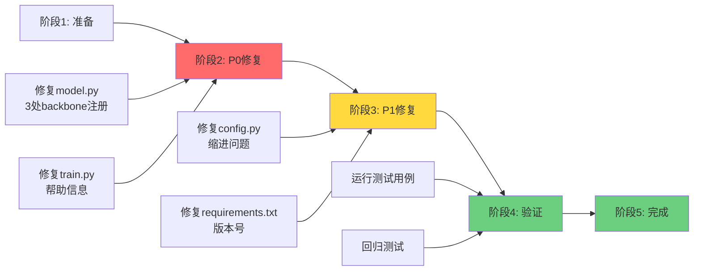
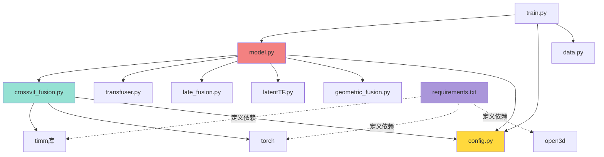
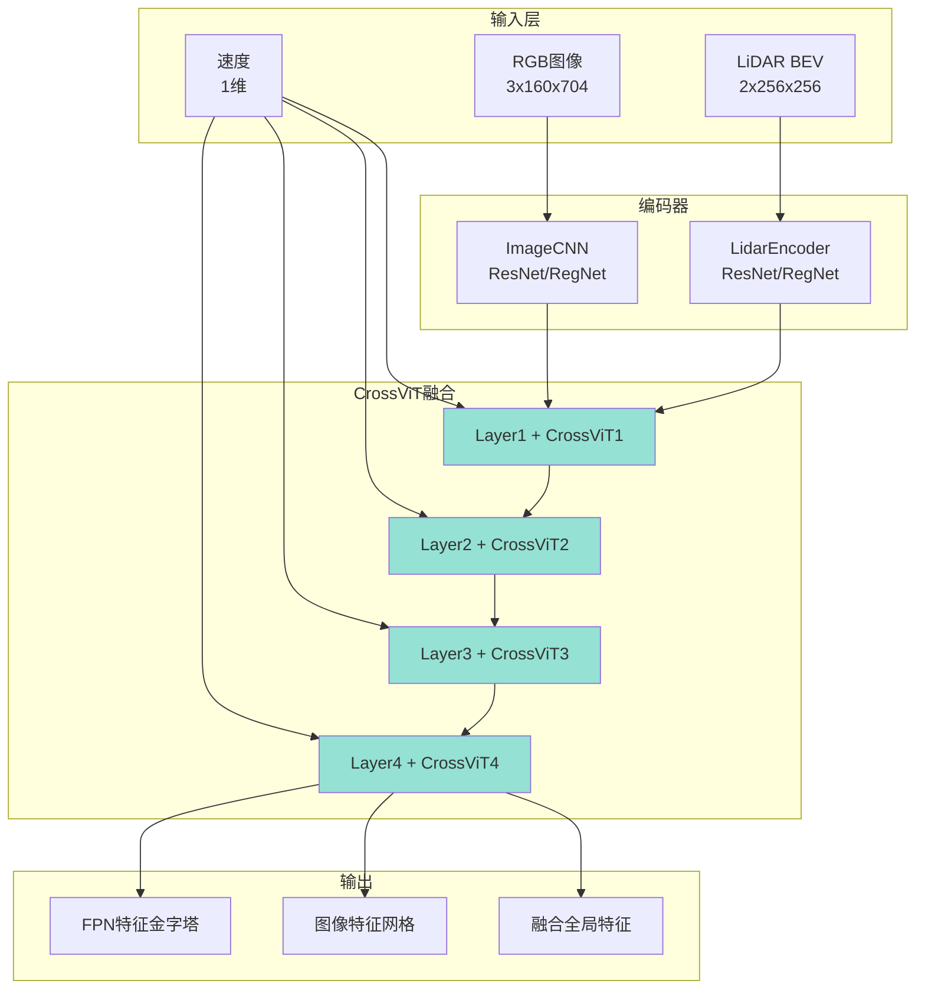
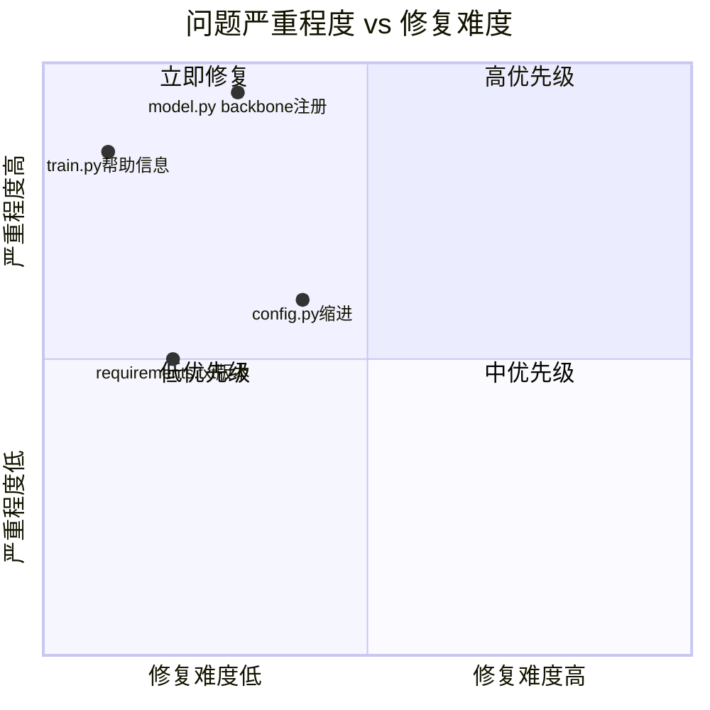
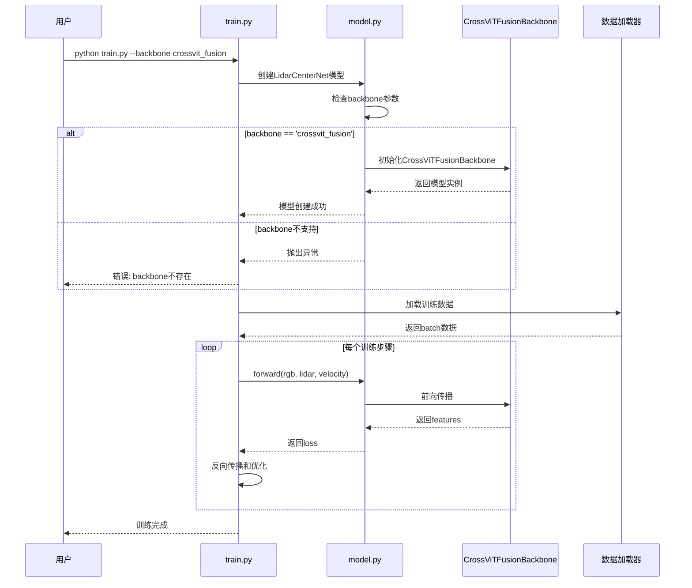

# CrossViT适配修复流程图

## 问题诊断流程

## 修复实施流程

## 文件依赖关系

## CrossViT集成架构

## 修复优先级矩阵

## 测试验证流程

---

## 使用说明

这些流程图帮助理解:
1. **问题诊断流程**: 如何识别和定位问题
2. **修复实施流程**: 按什么顺序修复
3. **文件依赖关系**: 各文件之间的关系
4. **CrossViT架构**: 数据如何在模型中流动
5. **优先级矩阵**: 哪些问题最紧急
6. **测试验证**: 如何验证修复是否成功
