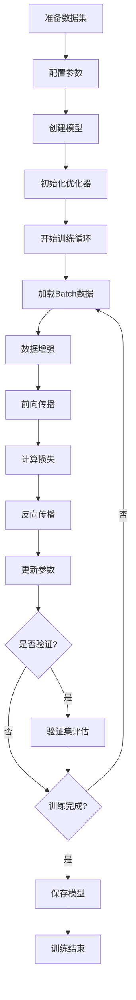
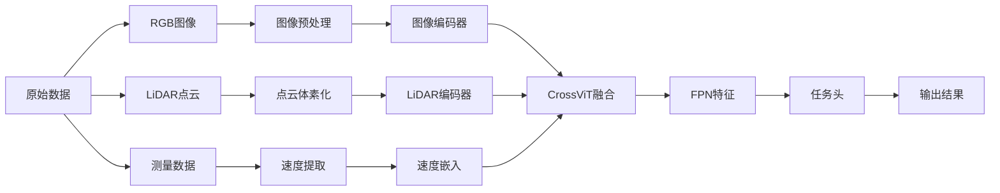
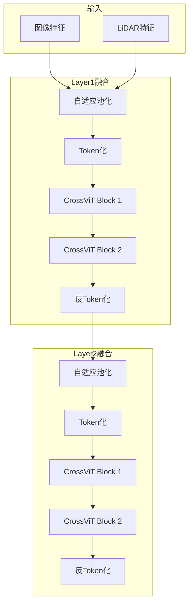
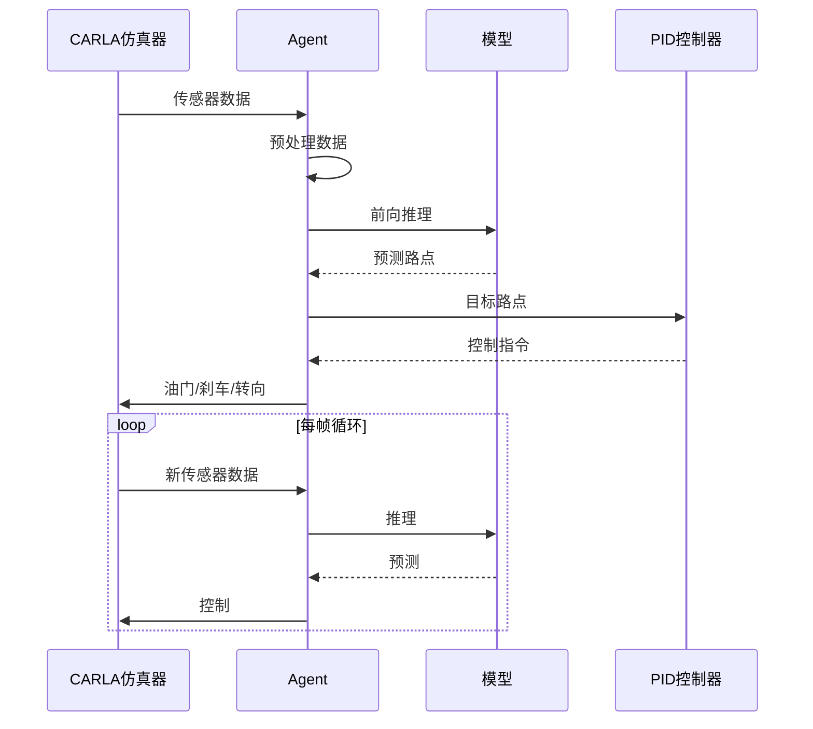

# TransFuser + CrossViT 详细流程README规划

## 文档目标
为添加了CrossViT融合模块的TransFuser项目创建一份全面的流程文档，涵盖从环境配置到模型部署的完整流程。

---

## 文档结构

### 1. 项目概述
**内容要点：**
- TransFuser项目简介（端到端自动驾驶）
- CrossViT集成的核心价值（双向跨模态注意力）
- 支持的融合方式对比表
- 项目特性列表
- 技术栈说明

**关键信息：**
- 基于CARLA仿真器
- 多模态融合（RGB图像 + LiDAR点云）
- 支持5种backbone：transFuser, late_fusion, latentTF, geometric_fusion, crossvit_fusion
- 输出：路点预测、目标检测、语义分割、深度估计

---

### 2. 系统架构

#### 2.1 整体架构图
```
数据采集 → 数据预处理 → 特征提取 → 多模态融合 → 任务头 → 控制输出
```

#### 2.2 CrossViT融合架构
- 双分支编码器（图像CNN + LiDAR编码器）
- 多尺度CrossViT融合（4个层级）
- FPN特征金字塔
- 多任务解码器

#### 2.3 数据流详解
- 输入：RGB (3×160×704) + LiDAR BEV (2×256×256) + 速度 (1)
- 中间特征：4个尺度的融合特征
- 输出：路点、检测框、分割图、深度图

---

### 3. 环境配置

#### 3.1 系统要求
- 操作系统：Ubuntu 18.04/20.04 或 Windows 10/11
- GPU：NVIDIA GPU with CUDA 11.1+
- 内存：16GB+ RAM
- 存储：100GB+ 可用空间

#### 3.2 依赖安装
```bash
# 核心依赖
pip install torch==1.9.0+cu111 torchvision==0.10.0+cu111
pip install timm==0.4.12
pip install mmcv-full==1.3.9
pip install mmdet==2.14.0

# 数据处理
pip install opencv-python pillow scikit-image
pip install open3d==0.13.0

# 其他工具
pip install ujson tqdm numpy
```

#### 3.3 CARLA仿真器安装
- 下载CARLA 0.9.10.1
- 配置环境变量
- 测试连接

---

### 4. 数据准备

#### 4.1 数据集结构
```
dataset_root/
├── Town01/
│   ├── route_00/
│   │   ├── rgb/              # RGB图像
│   │   ├── lidar/            # LiDAR点云 (.npy)
│   │   ├── topdown/          # BEV语义图
│   │   ├── depth/            # 深度图
│   │   ├── semantics/        # 语义分割
│   │   ├── label_raw/        # 3D检测标签
│   │   └── measurements/     # 测量数据 (速度、GPS等)
│   ├── route_01/
│   └── ...
├── Town02/
└── ...
```

#### 4.2 数据格式说明
- **RGB图像**：PNG格式，3个相机拼接（正前、左前60°、右前60°）
- **LiDAR点云**：NPY格式，(N, 4) 数组 [x, y, z, intensity]
- **BEV语义图**：PNG格式，编码的语义标签
- **测量数据**：JSON格式，包含速度、方向盘角度、GPS等

#### 4.3 数据增强策略
- 随机旋转：±20度
- 水平翻转：50%概率
- 保持跨模态对齐（图像和LiDAR同步变换）

---

### 5. 训练流程

#### 5.1 配置文件设置
**config.py 关键参数：**
```python
# 数据配置
seq_len = 1                    # 输入时序长度
pred_len = 4                   # 预测路点数量
img_resolution = (160, 704)    # 图像分辨率
lidar_resolution = (256, 256)  # LiDAR分辨率

# CrossViT配置
crossvit_blocks = 2            # 每个尺度的CrossViT块数
n_head = 8                     # 注意力头数
crossvit_mlp_ratio = 4.0       # MLP扩展比例

# 训练配置
lr = 1e-4                      # 学习率
batch_size = 4                 # 批次大小
epochs = 41                    # 训练轮数
```

#### 5.2 启动训练

**单GPU训练：**
```bash
python train.py \
  --id crossvit_exp01 \
  --batch_size 4 \
  --lr 1e-4 \
  --epochs 41 \
  --backbone crossvit_fusion \
  --image_architecture resnet34 \
  --lidar_architecture resnet18 \
  --use_velocity 1 \
  --root_dir /path/to/dataset \
  --setting all
```

**多GPU训练（推荐）：**
```bash
CUDA_VISIBLE_DEVICES=0,1 torchrun \
  --nnodes=1 \
  --nproc_per_node=2 \
  --max_restarts=0 \
  --rdzv_id=123456780 \
  --rdzv_backend=c10d \
  train.py \
  --id crossvit_exp01 \
  --batch_size 4 \
  --lr 1e-4 \
  --epochs 41 \
  --backbone crossvit_fusion \
  --parallel_training 1 \
  --sync_batch_norm 1 \
  --root_dir /path/to/dataset
```

#### 5.3 训练监控
- TensorBoard日志：`tensorboard --logdir log/crossvit_exp01`
- 关键指标：
  - 路点损失 (wp_loss)
  - 检测损失 (det_loss)
  - 分割损失 (seg_loss)
  - 深度损失 (depth_loss)

#### 5.4 学习率调度
- Epoch 0-29: lr = 1e-4
- Epoch 30-39: lr = 1e-5 (降低10倍)
- Epoch 40+: lr = 1e-6 (再降低10倍)

---

### 6. 推理/评估流程

#### 6.1 模型加载
```python
from config import GlobalConfig
from model import LidarCenterNet

config = GlobalConfig(setting='eval')
model = LidarCenterNet(
    config, 
    device='cuda',
    backbone='crossvit_fusion',
    image_architecture='resnet34',
    lidar_architecture='resnet18',
    use_velocity=True
)

# 加载权重
checkpoint = torch.load('model.pth')
model.load_state_dict(checkpoint)
model.eval()
```

#### 6.2 单帧推理
```python
# 准备输入
rgb = preprocess_image(image)      # (1, 3, 160, 704)
lidar = preprocess_lidar(points)   # (1, 2, 256, 256)
velocity = torch.tensor([[speed]]) # (1, 1)
target_point = torch.tensor([[x, y]]) # (1, 2)

# 推理
with torch.no_grad():
    output = model(rgb, lidar, target_point, velocity)
    
# 解析输出
waypoints = output['pred_wp']      # 预测路点
bboxes = output['bounding_box']    # 检测框
segmentation = output['segmentation'] # 语义分割
```

#### 6.3 CARLA部署
使用 `submission_agent.py` 在CARLA仿真器中运行：

```bash
# 1. 启动CARLA服务器
./CarlaUE4.sh -quality-level=Epic -world-port=2000

# 2. 运行评估
python leaderboard/leaderboard_evaluator.py \
  --routes=routes_testing.xml \
  --scenarios=scenarios.json \
  --agent=submission_agent.py \
  --agent-config=model_ckpt/ \
  --track=SENSORS
```

---

### 7. 代码示例

#### 7.1 基本使用示例
```python
# 见 example_crossvit_usage.py
from config import GlobalConfig
from crossvit_fusion import CrossViTFusionBackbone

config = GlobalConfig()
config.crossvit_blocks = 2

backbone = CrossViTFusionBackbone(
    config=config,
    image_architecture='resnet34',
    lidar_architecture='resnet18',
    use_velocity=True
)

# 前向传播
features, image_grid, fused = backbone(image, lidar, velocity)
```

#### 7.2 自定义数据加载
```python
from data import CARLA_Data
from torch.utils.data import DataLoader

config = GlobalConfig(root_dir='/data', setting='all')
dataset = CARLA_Data(config.train_data, config)
dataloader = DataLoader(
    dataset, 
    batch_size=4, 
    num_workers=4,
    shuffle=True
)

for batch in dataloader:
    rgb = batch['rgb']
    lidar = batch['lidar']
    # 训练代码...
```

#### 7.3 混合精度训练
```python
from torch.cuda.amp import autocast, GradScaler

scaler = GradScaler()

for batch in dataloader:
    optimizer.zero_grad()
    
    with autocast():
        output = model(batch)
        loss = criterion(output, target)
    
    scaler.scale(loss).backward()
    scaler.step(optimizer)
    scaler.update()
```

---

### 8. 流程图

#### 8.1 完整训练流程


#### 8.2 数据处理流程


#### 8.3 CrossViT融合细节


#### 8.4 推理部署流程


---

### 9. 故障排查

#### 9.1 常见问题

**Q1: 显存不足 (CUDA out of memory)**
```
解决方案：
1. 减小batch_size（推荐4或2）
2. 启用混合精度训练 (FP16)
3. 使用梯度累积
4. 减少crossvit_blocks数量

代码示例：
# 梯度累积
accumulation_steps = 4
for i, batch in enumerate(dataloader):
    loss = model(batch) / accumulation_steps
    loss.backward()
    if (i + 1) % accumulation_steps == 0:
        optimizer.step()
        optimizer.zero_grad()
```

**Q2: 训练不稳定/损失爆炸**
```
解决方案：
1. 降低学习率（1e-5）
2. 使用梯度裁剪
3. 增加warmup步数
4. 检查数据归一化

代码示例：
torch.nn.utils.clip_grad_norm_(model.parameters(), max_norm=1.0)
```

**Q3: 导入CrossViT模块失败**
```
错误信息：
ModuleNotFoundError: No module named 'crossvit_fusion'

解决方案：
1. 确认 crossvit_fusion.py 存在
2. 检查 model.py 中是否导入
3. 验证 Python 路径配置
```

**Q4: 多GPU训练同步问题**
```
解决方案：
1. 使用 --sync_batch_norm 1
2. 确保所有GPU可见
3. 检查 NCCL 后端配置

启动命令：
CUDA_VISIBLE_DEVICES=0,1 torchrun ... --sync_batch_norm 1
```

#### 9.2 性能优化建议

**训练加速：**
- 使用混合精度训练（AMP）
- 启用数据预加载（num_workers=4）
- 使用磁盘缓存（--use_disk_cache 1）
- 多GPU并行训练

**推理加速：**
- 模型量化（INT8）
- TensorRT优化
- 批量推理
- 减少不必要的计算

---

### 10. API参考

#### 10.1 核心类

**GlobalConfig**
```python
class GlobalConfig:
    """全局配置类"""
    
    # 数据配置
    seq_len: int = 1
    pred_len: int = 4
    img_resolution: tuple = (160, 704)
    
    # CrossViT配置
    crossvit_blocks: int = 2
    n_head: int = 8
    crossvit_mlp_ratio: float = 4.0
    
    # 训练配置
    lr: float = 1e-4
    batch_size: int = 4
```

**CrossViTFusionBackbone**
```python
class CrossViTFusionBackbone(nn.Module):
    """CrossViT融合主干网络"""
    
    def __init__(
        self,
        config: GlobalConfig,
        image_architecture: str = 'resnet34',
        lidar_architecture: str = 'resnet18',
        use_velocity: bool = True
    ):
        """
        参数:
            config: 全局配置对象
            image_architecture: 图像编码器架构
            lidar_architecture: LiDAR编码器架构
            use_velocity: 是否使用速度信息
        """
    
    def forward(self, image, lidar, velocity):
        """
        前向传播
        
        参数:
            image: (B, 3, H, W) RGB图像
            lidar: (B, C, H, W) LiDAR BEV
            velocity: (B, 1) 速度
            
        返回:
            features: FPN特征金字塔列表
            image_features_grid: 图像特征网格
            fused_features: 融合全局特征
        """
```

**LidarCenterNet**
```python
class LidarCenterNet(nn.Module):
    """完整的自动驾驶模型"""
    
    def __init__(
        self,
        config: GlobalConfig,
        device: str = 'cuda',
        backbone: str = 'crossvit_fusion',
        image_architecture: str = 'resnet34',
        lidar_architecture: str = 'resnet18',
        use_velocity: bool = True
    ):
        """
        参数:
            config: 全局配置
            device: 设备 ('cuda' 或 'cpu')
            backbone: 融合方式
            image_architecture: 图像编码器
            lidar_architecture: LiDAR编码器
            use_velocity: 是否使用速度
        """
    
    def forward(self, image, lidar, target_point, ego_vel):
        """
        前向传播
        
        参数:
            image: (B, 3, H, W)
            lidar: (B, C, H, W)
            target_point: (B, 2)
            ego_vel: (B, 1)
            
        返回:
            dict: 包含预测结果的字典
                - pred_wp: 预测路点
                - bounding_box: 检测框
                - segmentation: 语义分割
                - depth: 深度估计
        """
```

#### 10.2 工具函数

**数据预处理**
```python
def lidar_to_histogram_features(lidar, config):
    """将LiDAR点云转换为BEV直方图特征"""

def preprocess_image(image, config):
    """预处理RGB图像"""

def augment_data(image, lidar, angle, flip):
    """数据增强（旋转和翻转）"""
```

**可视化**
```python
def visualize_bev(bev_semantic):
    """可视化BEV语义图"""

def draw_waypoints(image, waypoints):
    """在图像上绘制预测路点"""

def visualize_detections(image, bboxes):
    """可视化检测框"""
```

---

## 附录

### A. 支持的Backbone对比

| Backbone | 融合方式 | 参数量 | 推理速度 | 精度 | 适用场景 |
|----------|---------|--------|---------|------|---------|
| late_fusion | 特征拼接 | 最少 | 最快 | 中等 | 快速原型 |
| transFuser | GPT Transformer | 中等 | 中等 | 高 | 平衡性能 |
| latentTF | 潜在空间融合 | 中等 | 中等 | 高 | 研究实验 |
| geometric_fusion | 几何投影 | 中等 | 中等 | 高 | 精确对齐 |
| **crossvit_fusion** | **双向跨注意力** | **较多** | **较慢** | **最高** | **最佳性能** |

### B. 数据集统计

- 训练数据：~200小时驾驶数据
- 场景数量：6个城镇 × 多条路线
- 天气条件：晴天、雨天、雾天等
- 交通密度：低、中、高

### C. 性能基准

**CARLA Leaderboard (Town05 Long)**
- 路线完成率：85%+
- 违规次数：<0.5/km
- 平均速度：25 km/h

### D. 引用

```bibtex
@inproceedings{transfuser2021,
  title={Multi-Modal Fusion Transformer for End-to-End Autonomous Driving},
  author={Prakash, Aditya and Chitta, Kashyap and Geiger, Andreas},
  booktitle={CVPR},
  year={2021}
}

@inproceedings{crossvit2021,
  title={CrossViT: Cross-Attention Multi-Scale Vision Transformer for Image Classification},
  author={Chen, Chun-Fu and Fan, Quanfu and Panda, Rameswar},
  booktitle={ICCV},
  year={2021}
}
```

---

## 文档维护

- **创建日期**: 2026-03-07
- **最后更新**: 2026-03-07
- **维护者**: TransFuser + CrossViT团队
- **版本**: v1.0

---

**下一步：根据此规划创建最终的 README.md 文档**
